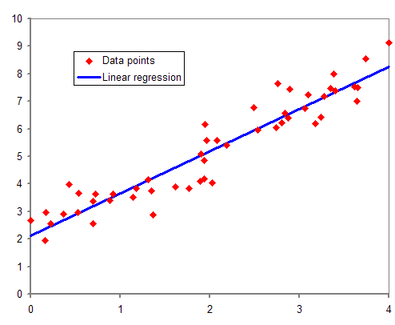
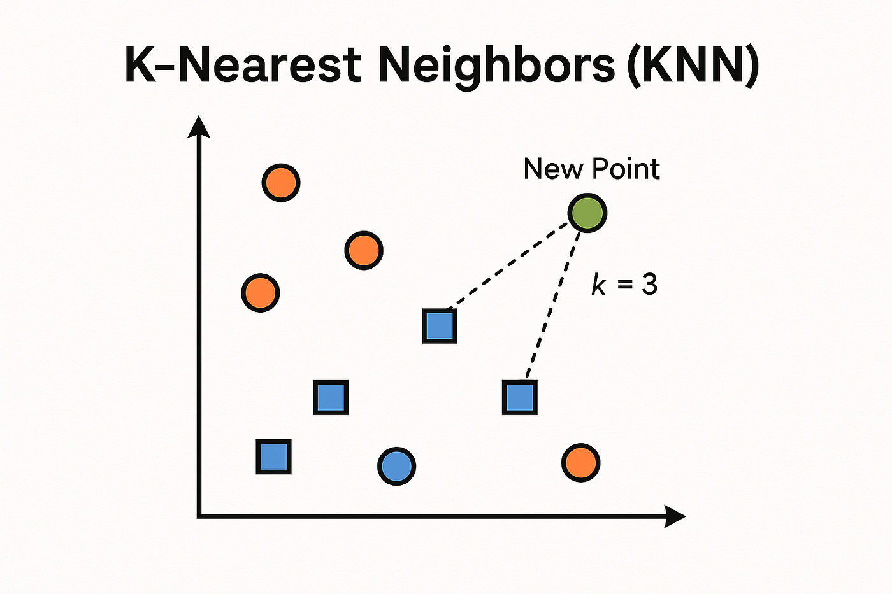
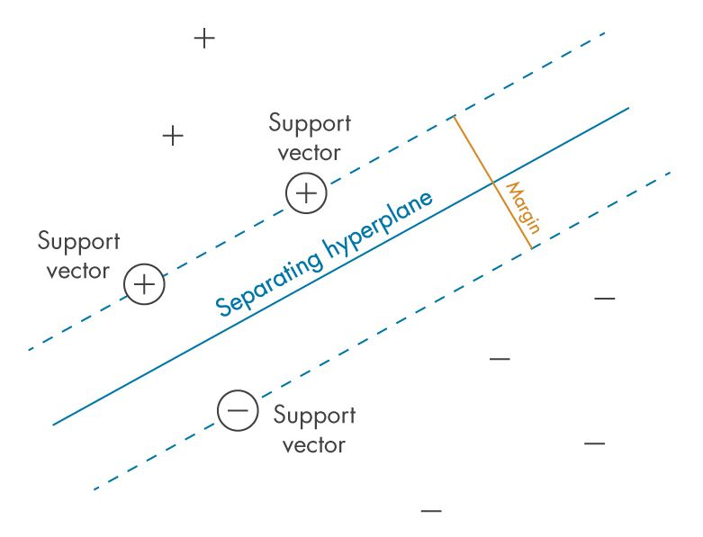

## 2. MODEL CARDS

## 2.1 BASELINE ML & LINEAR METHODS (TABULAR DATA)

**Quick links**
* [0. How to use this QRH](0%20-%20hot%20to%20use.md#1-decision-matrix)
* [2.2 Ensemble Methods](2.2%20-%20ensemble.md)
* [2.3 Unsupervised & Representation](2.3%20-%20unsupervised.md)
* [2.4 Deep Learning](2.4%20-%20deep%20learning.md)
* [3. Troubleshooting](3%20-%20troubleshooting.md)
* Sections: [Linear / Logistic Regression](#211-linear--logistic-regression), [KNN](#212-k-nearest-neighbors-knn), [Decision Trees](#213-decision-trees-cart), [SVM](#214-support-vector-machines-svm)

### 2.1.1 LINEAR / LOGISTIC REGRESSION
**[SUPERVISED] [TABULAR] [REGRESSION / CLASSIFICATION] [HIGH INTERPRETABILITY]**

**LEVEL 1: TRIAGE**
* **Input / Output:** Input: Numerical vectors (independent features). Output: Continuous value (Linear) or class probability between 0 and 1 (Logistic).
* **GO (Use when):** Absolute baseline for any tabular task. Need for direct mathematical interpretability (coefficients/weights indicate the exact feature importance).
* **NO-GO (Avoid when):** Presence of strong non-linear relationships between features. High multicollinearity (highly correlated features).

**LEVEL 2: OPERATIONS**
* **Principles of operation:**
  * Models the relationship between input and output by computing a weighted sum of the features.
  * In Linear Regression, the output is direct. In Logistic Regression, the weighted sum is passed through a Sigmoid function to squeeze the result between 0 and 1.
  * It does not learn feature interactions (e.g. Feature A * Feature B) unless explicitly provided upstream.

| PROS | CONS |
| :--- | :--- |
| Training and inference are essentially instantaneous. | Intrinsically limited: it will underfit complex patterns. |
| Very high interpretability (white-box model). | Requires extensive manual feature engineering. |
| Excellent behavior in low-dimensional spaces. | Suffers from outliers if not treated. |

**LEVEL 3: DEEP DIVE & TROUBLESHOOTING**
* **Key Hyperparameters:**
  * `penalty` (Regularization): `l1` (Lasso, zeros out useless weights, performs feature selection), `l2` (Ridge, reduces extreme weights proportionally).
  * `C` (Inverse regularization strength in Logistic): **High C** = Low regularization, follows training closely. **Low C** = High regularization, more general model and smaller weights.
* **Typical Loss Function:** MSE (Mean Squared Error) for Linear; Log-Loss (Binary Cross-Entropy) for Logistic.
* **Common Pitfalls & Quick Fixes:**
  * **Pitfall:** Enormous, unstable weights (coefficients) and broken results.
    * *Quick Fix:* Very likely you have multicollinearity and scale differences. Run a `StandardScaler` and apply Ridge regularization (`L2`).

---

### 2.1.2 K-NEAREST NEIGHBORS (KNN)
**[SUPERVISED] [TABULAR] [CLASSIFICATION / REGRESSION] [INSTANCE-BASED]**

**LEVEL 1: TRIAGE**
* **Input / Output:** Input: Scaled numerical vectors. Output: Majority class (or mean for regression) of the neighbors.
* **GO (Use when):** Simple recommendation systems, geospatial datasets, or when the concept of “similarity” between data is the main logical rule of the problem.
* **NO-GO (Avoid when):** Real-time inference on very large production datasets (too slow at inference). High-dimensional spaces (e.g. images, text).

**LEVEL 2: OPERATIONS**
* **Principles of operation:**
  * Lazy Learning: there is no true training phase. It stores the entire dataset.
  * During inference, it computes the distance between the new point and all points stored in the dataset.
  * Selects the `K` nearest points and “votes” for the winning class.

| PROS | CONS |
| :--- | :--- |
| Training phase (fit) is immediate (zero cost). | Inference phase (predict) is very slow and computationally heavy O(N). |
| Very flexible (captures complex non-linear decision boundaries). | Memory cost O(N): it must keep the entire training set in RAM in production. |
| Intuitive and explainable logic to stakeholders. | Perfect victim of the Curse of Dimensionality. |

**LEVEL 3: DEEP DIVE & TROUBLESHOOTING**
* **Key Hyperparameters:**
  * `n_neighbors` (K): Number of neighbors. **Low K (1-3)** = Jagged boundaries, captures noise, Overfitting. **High K (e.g. 50)** = Smooth boundaries, class dominance, Underfitting.
  * `metric`: How distance is computed (`euclidean` default, `manhattan` for grids, `cosine` for text/directions).
  * `weights`: `uniform` (all neighbors weight equally) or `distance` (closer neighbors carry more vote weight).
* **Typical Loss Function:** N/A (algorithm not based on gradient optimization).
* **Common Pitfalls & Quick Fixes:**
  * **Pitfall:** Poor performance even on simple problems. One feature dominates the decisions completely.
    * *Quick Fix:* Geometric distances are sensitive to scale. Applying `StandardScaler` or `MinMaxScaler` is a critical system requirement.
  * **Pitfall:** Accuracy collapses as the number of columns (features) increases.
    * *Quick Fix:* Curse of Dimensionality (in high-dimensional spaces, points tend to become equidistant). Apply `PCA` or feature selection before KNN.

---

### 2.1.3 DECISION TREES (CART)
**[SUPERVISED] [TABULAR] [CLASSIFICATION / REGRESSION] [RULE-BASED]**

**LEVEL 1: TRIAGE**
* **Input / Output:** Input: Numerical or categorical data (no normalization required). Output: Predicted class or expected value.
* **GO (Use when):** Absolute need to extract human decision rules (e.g. clinical/legal) in flow-chart form (IF-THEN-ELSE). Models on a mix of strange numerical and categorical variables.
* **NO-GO (Avoid when):** The problem requires extrapolation beyond the training data range (trees cannot extrapolate continuous trends beyond the last split).

**LEVEL 2: OPERATIONS**
* **Principles of operation:**
  * Greedy algorithm: recursively splits the feature space by making sequential binary cuts (e.g. Age > 30).
  * At each node, it looks for the split that maximizes Information Gain (or minimizes impurity).
  * Terminal leaves represent the final classification of the subset of data that followed that path.

| PROS | CONS |
| :--- | :--- |
| Scale invariant: no scaling or normalization required. | Chronic natural tendency to Overfitting (if not constrained). |
| Handles missing values and non-linearity implicitly. | Extreme variance: a tiny change in the data changes the whole tree. |
| Printable, visually interpretable flow diagram at 100%. | Orthogonal cuts struggle with diagonal decision boundaries. |

**LEVEL 3: DEEP DIVE & TROUBLESHOOTING**
* **Key Hyperparameters:**
  * `max_depth`: Depth limit. Vital for cutting memorization.
  * `min_samples_split` / `min_samples_leaf`: Minimum number of samples required to split an internal node or create a leaf. Increasing them forces the tree to generalize.
  * `criterion`: Method for measuring split quality (`gini` for speed, `entropy` for balance).
* **Typical Loss Function:** Gini Impurity or Entropy (Classification); MSE or MAE (Regression).
* **Common Pitfalls & Quick Fixes:**
  * **Pitfall:** The model has 99% accuracy in training and 50% in test. The printed tree is enormous.
    * *Quick Fix:* The tree has gone into pure memorization (it created a leaf for each individual example). Intervene heavily with pruning: impose `max_depth` (e.g. 5-7) and raise `min_samples_leaf` above 10.

---

### 2.1.4 SUPPORT VECTOR MACHINES (SVM)
**[SUPERVISED] [TABULAR] [CLASSIFICATION / REGRESSION]**

**LEVEL 1: TRIAGE**
* **Input / Output:** Input: Numerical vectors (textual/categorical features must be vectorized). Output: Predicted class (SVC) or continuous value (SVR).
* **GO (Use when):** Medium-small datasets with high dimensionality (e.g. classic NLP based on TF-IDF). Need for robust and mathematically guaranteed decision boundaries.
* **NO-GO (Avoid when):** Very large datasets (N > 100,000 rows). Presence of strong noise or heavily overlapping classes.

**LEVEL 2: OPERATIONS**
* **Principles of operation:**
  * **Margin Maximization:** Finds the optimal hyperplane that separates classes by maximizing the distance (margin) between the hyperplane itself and the closest data points (the *Support Vectors*).
  * **Kernel Trick:** Implicitly projects the original data, if it is not linearly separable, into a higher-dimensional space where a linear cut becomes possible.
  * **Sparsity:** Once trained, the model uses only the Support Vectors for inference. The rest of the dataset is ignored.

| PROS | CONS |
| :--- | :--- |
| Highly effective in high-dimensional spaces (even when features > samples). | Computational complexity O(N^2) or O(N^3): does not scale to massive datasets. |
| Memory-efficient in inference (uses only support vectors). | Extremely sensitive to feature scale. |
| Versatile thanks to the choice of different Kernels (Linear, RBF, Polynomial). | No native probabilities (requires costly calibrations such as the Platt method). |

**LEVEL 3: DEEP DIVE & TROUBLESHOOTING**
* **Key Hyperparameters:**
  * `C` (Regularization): Inversely proportional to regularization. **High C** = Strict penalty for errors, narrow margin, Overfitting risk. **Low C** = Wide margin, tolerance for errors, Underfitting risk.
  * `kernel`: Space transformation algorithm (`linear`, `poly`, `rbf`, `sigmoid`).
  * `gamma` (only for RBF/Poly/Sigmoid): Defines the influence area of a single point. **High Gamma** = Narrow radius (model captures noise, Overfitting). **Low Gamma** = Wide radius (boundaries too fluid, Underfitting).
* **Typical Loss Function:** Hinge Loss (for classification).
* **Common Pitfalls & Quick Fixes:**
  * **Pitfall:** Endless training or total freeze.
    * *Quick Fix:* If using the `rbf` kernel on dataset > 100k, abort. Use `LinearSVC` (liblinear-based implementation, which scales much better) or sample the data.
  * **Pitfall:** Accuracy comparable to a coin toss or disastrous performance.
    * *Quick Fix:* Run a `StandardScaler` on the data. SVMs measure geometric distances; unscaled features destroy the model calculations.
