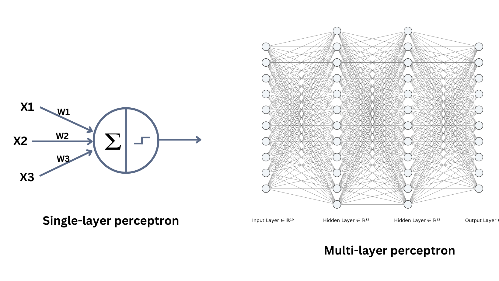

## 2.4 DEEP LEARNING FUNDAMENTALS

**Quick links**
* [0. How to use this QRH](0%20-%20hot%20to%20use.md#1-decision-matrix)
* [2.3 Unsupervised & Representation](2.3%20-%20unsupervised.md)
* [2.5 Time Series](2.5%20-%20time%20series.md)
* [2.6 Computer Vision](2.6%20-%20computer%20vision.md)
* [2.7 NLP](2.7%20-%20NLP.md)
* Section: [MLP / FFN](#241-multi-layer-perceptron-mlp--ffn)

### 2.4.1 MULTI-LAYER PERCEPTRON ([MLP](0%20-%20hot%20to%20use.md#essential-acronym-glossary) / FFN)
**[SUPERVISED] [TABULAR / DENSE] [DEEP LEARNING BASE]**

**LEVEL 1: TRIAGE**
* **Input / Output:** Input: Dense numerical vectors (features scaled rigorously). Output: Class (Softmax/Sigmoid) or continuous value (Linear).
* **GO (Use when):** Tabular data at very large scale where trees run out of memory. Need to learn highly non-linear and hierarchical features. Base for more complex architectures (terminal part of CNNs or Transformers).
* **NO-GO (Avoid when):** Native spatial data (images -> use [CNN](0%20-%20hot%20to%20use.md#essential-acronym-glossary)) or sequential data (text/audio -> use [RNN](0%20-%20hot%20to%20use.md#essential-acronym-glossary)/Transformer). Small/medium tabular datasets (XGBoost dominates [MLP](0%20-%20hot%20to%20use.md#essential-acronym-glossary) in performance and setup time).

**LEVEL 2: OPERATIONS**
* **Principles of operation:**
  * **Forward Pass:** Data passes through dense layers (Fully Connected) where each neuron is connected to all neurons in the previous layer.
  * **Non-Linearity:** The output of each weighted sum is passed through an activation function (e.g. ReLU) that allows the network to model complex mathematical relationships (Universal Approximation Theorem).
  * **Backpropagation:** Computes the gradients of the error with respect to each weight from output backward, updating them via optimizers (SGD, Adam).

| PROS | CONS |
| :--- | :--- |
| Extreme flexibility: can approximate any mathematical function. | Totally black-box. |
| Highly scalable: [GPU](0%20-%20hot%20to%20use.md#essential-acronym-glossary) training processes huge mini-batches. | Data hungry: overfits instantly on small datasets. |
| Allows defining custom business-oriented loss functions. | Requires heavy engineering setup (scaling, architectural tuning). |

**LEVEL 3: DEEP DIVE & TROUBLESHOOTING**
* **Key Hyperparameters:**
  * `hidden_layers` & `neurons_per_layer`: Control capacity. Deep and narrow networks are better than a single huge layer.
  * `learning_rate` & `optimizer`: Adam (with lr ~ 1e-3 or 1e-4) is the industrial baseline; SGD with momentum requires more tuning but often generalizes better in the end.
  * `dropout_rate`: Randomly drops neurons during training to force redundancy and avoid overfitting (typical values: 0.2 - 0.5).
* **Typical Loss Function:** [MSE](0%20-%20hot%20to%20use.md#essential-acronym-glossary)/[MAE](0%20-%20hot%20to%20use.md#essential-acronym-glossary) (Regression); Categorical Cross-Entropy (Multi-class Classification); Binary Cross-Entropy (Binary Classification).
* **Common Pitfalls & Quick Fixes:**
  * **Pitfall:** The network does not learn anything; loss stays flat from the first epoch.
    * *Quick Fix:* 1) Check that inputs are normalized (StandardScaler). Neural networks hate high variance. 2) Vanishing Gradient: ensure hidden layers use `ReLU` activations (not Sigmoid) and use `He/Glorot` weight initialization.

---
