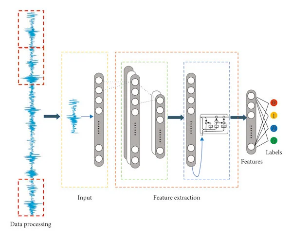
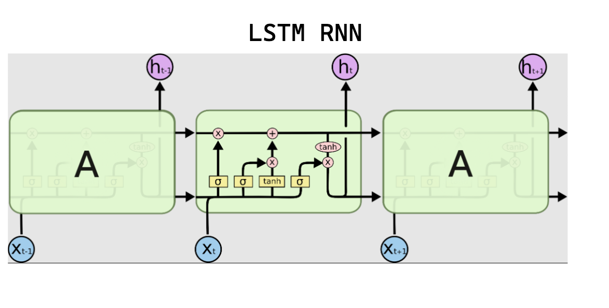

## 2.5 SEQUENCE, TIME SERIES & FORECASTING

**Quick links**
* [0. How to use this QRH](0%20-%20hot%20to%20use.md#13-decision-tree-vision-and-time-series-space--time)
* [2.4 Deep Learning](2.4%20-%20deep%20learning.md)
* [2.6 Computer Vision](2.6%20-%20computer%20vision.md)
* Sections: [ARIMA / SARIMAX](#251-arima--sarimax), [Prophet](#252-prophet-meta), [1D-CNN & TCN](#253-1d-cnn--tcn-temporal-convolutional-networks), [RNN / LSTM / GRU](#254-rnn-lstm--gru-recurrent-neural-networks)

### 2.5.1 ARIMA / SARIMAX
**[SUPERVISED] [TIME SERIES] [PARAMETRIC STATISTICAL MODEL]**

**LEVEL 1: TRIAGE**
* **Input / Output:** Input: Univariate vector of historical series (SARIMAX can also accept exogenous regressors). Output: Future point forecast with confidence intervals.
* **GO (Use when):** Univariate forecasting over short horizons. Data with clear linear trend and seasonality patterns. Need for formal statistical rigor.
* **NO-GO (Avoid when):** Very high-frequency data (e.g. IoT data at the second level) or strongly noisy data. Complex non-linear multivariate interactions.

**LEVEL 2: OPERATIONS**
* **Principles of operation:**
  * **AR (Auto-Regressive):** Models the current value based on past values (historical lags).
  * **I (Integrated):** Differentiation of data (subtracts value at t from value at t-1) to remove trend and make the series *stationary*.
  * **MA (Moving Average):** Models the model error as a linear combination of past errors.
  * **S (Seasonal):** Adds the same components for seasonal lags.

| PROS | CONS |
| :--- | :--- |
| Total statistical interpretability. Native confidence intervals. | Requires the historical series to be made stationary (constant mean and variance over time). |
| Excellent on small datasets where Machine Learning would fail due to overfitting. | Setup process (parameter identification) is mathematically tedious. |

**LEVEL 3: DEEP DIVE & TROUBLESHOOTING**
* **Key Hyperparameters (Order p,d,q):**
  * `p` (AR terms): Past lags (identifiable via PACF plot).
  * `d` (Differentiation degree): How many times to subtract the previous value to eliminate the trend.
  * `q` (MA terms): Error lags (identifiable via ACF plot).
* **Common Pitfalls & Quick Fixes:**
  * **Pitfall:** Forecasts rapidly degenerate into a flat line or confidence intervals explode toward infinity.
    * *Quick Fix:* The model is not capturing real dynamics but only noise, or the series is not stationary. Run ADF (Augmented Dickey-Fuller) tests to check stationarity. Use automatic search algorithms (e.g. `pmdarima.auto_arima`) instead of manual tuning via ACF/PACF.

---

### 2.5.2 PROPHET (Meta)
**[SUPERVISED] [TIME SERIES] [ADDITIVE MODEL]**

**LEVEL 1: TRIAGE**
* **Input / Output:** Input: DataFrame with 2 required columns (`ds` = timestamp, `y` = target). Output: DataFrame with predictions (`yhat`) and confidence intervals.
* **GO (Use when):** Business forecasting (e.g. sales, web traffic) with daily/weekly data. Strong multiple seasonal effects (day of week + month of year) and known events/holidays. Historical data with gaps/missing values.
* **NO-GO (Avoid when):** The future depends heavily on the immediate past (e.g. sub-second stock movements). Prophet is a “curve-fitting” model, not a true pure autoregressive model.

**LEVEL 2: OPERATIONS**
* **Principles of operation:**
  * Decomposes the series into three elements via additive models: `y(t) = Trend(t) + Seasonality(t) + Holidays(t) + Error`.
  * Trend is modeled via linear or logistic curves with dynamic changepoints.
  * Seasonality is modeled via Fourier Series.

| PROS | CONS |
| :--- | :--- |
| Natively handles gaps in historical data and anomalies. | Ignores very short-term autoregressive dynamics (recent shocks). |
| Simple to explain to management. Adding custom holidays is trivial. | Slow to train if extended to thousands of different time series. |

**LEVEL 3: DEEP DIVE & TROUBLESHOOTING**
* **Key Hyperparameters:**
  * `changepoint_prior_scale`: Trend flexibility. **High** = The trend adjusts to every tiny variation (Overfitting). **Low** = Rigid trend (Underfitting).
  * `seasonality_prior_scale`: Strength of seasonality.
* **Common Pitfalls & Quick Fixes:**
  * **Pitfall:** The model goes haywire and predicts absurd future values after a recent drastic business change.
    * *Quick Fix:* Prophet tends to over-extrapolate the latest changepoint. Reduce `changepoint_prior_scale` or use the “Logistic Growth” mode by imposing `cap` and `floor` constraints in the training data.

---

### 2.5.3 1D-CNN & TCN (TEMPORAL CONVOLUTIONAL NETWORKS)
**[SUPERVISED] [TIME SERIES / SEQUENCES] [DEEP LEARNING] [CAUSAL]**

**LEVEL 1: TRIAGE**
* **Input / Output:** Input: 3D tensor `[Batch, Timesteps, Features]`. Output: `[Batch, Features]` (final forecasting) or `[Batch, Timesteps, Features]` (sequential filtering).
* **GO (Use when):** Local pattern recognition at high speed. Very high-frequency data (e.g. clinical EEG, industrial vibrations, IoT sensors, audio traces). Systems requiring extreme parallelization on GPU and minimal latency.
* **NO-GO (Avoid when):** The problem requires remembering a very complex remote logical state that does not follow a periodic pattern (e.g. complex language translation, where RNNs or Transformers dominate).

**LEVEL 2: OPERATIONS**
* **Principles of operation:**
  * **Causal Convolution:** A filter (kernel) slides along the time axis. Padding is asymmetric (causal): at time `t`, the filter can only look at data from `t` backward. The future is masked to prevent data leakage.
  * **Dilation (TCN - Temporal Convolutional Network):** In TCNs, filters introduce “gaps” (dilation) between observed samples. This allows the Receptive Field (the historical time window seen by the network) to expand exponentially without increasing the number of parameters and computing costs too much.

| PROS | CONS |
| :--- | :--- |
| Extremely fast training (fully parallelizable on GPU). | Fixed Receptive Field: the network has a blind temporal horizon beyond its architectural configuration. |
| Zero Vanishing Gradient problems along the temporal axis (computation is feed-forward). | In very long sequence tasks it requires a lot of RAM to store activations for each spatial layer. |
| Highly stable during training compared to RNNs. | Struggles with input sequences whose lengths vary drastically within the same batch. |

**LEVEL 3: DEEP DIVE & TROUBLESHOOTING**
* **Key Hyperparameters:**
  * `kernel_size`: How many temporal steps the single filter looks at in one move (e.g. 3, 5, 7).
  * `dilation_rate`: Expansion factor of the filter’s view (usually doubles at each layer: 1, 2, 4, 8, 16).
  * `filters`: Number of feature maps extracted by each layer.
* **Typical Loss Function:** MSE / Huber Loss (robust to outliers for temporal regression).
* **Common Pitfalls & Quick Fixes:**
  * **Pitfall:** Excellent performance in testing but predicting late (chronic lag) in production. Or catastrophic Data Leakage (predicts the future perfectly but fails in production).
    * *Quick Fix:* You did not apply `padding="causal"`. Standard CNNs (`same` or `valid` padding) peek into the future (`t+1`). This is the number one architectural error in time series with CNNs.
  * **Pitfall:** The model cannot capture long-term seasonality (e.g. monthly trends on hourly data).
    * *Quick Fix:* The Receptive Field (real historical window) is too small. Increase the stacked layers or, better, increase `dilation_rate` exponentially.

---

### 2.5.4 RNN, LSTM & GRU (RECURRENT NEURAL NETWORKS)
**[SUPERVISED] [TIME SERIES / SEQUENCES] [DEEP LEARNING] [STATE MEMORY]**

**LEVEL 1: TRIAGE**
* **Input / Output:** Input: 3D tensor `[Batch, Timesteps, Features]`. Output: `[Batch, Features]` (Many-to-One) or `[Batch, Timesteps, Features]` (Many-to-Many).
* **GO (Use when):** Temporal dependence is not of fixed length or long-range historical memory is vital to determine the present. Great for spatial trajectories, classic NLP, and complex multivariate time series.
* **NO-GO (Avoid when):** Severe time limits for training. Purely tabular and temporally uncorrelated data. Extremely large NLP datasets (use Transformers directly).

**LEVEL 2: OPERATIONS**
* **Principles of operation:**
  * **Sequential Nature (Basic RNN):** Processes data step by step (`t=1`, `t=2`...). Maintains a *Hidden State* (a memory matrix) updated by integrating the current data with the previous state.
  * **Gates (Memory Ports):** Classical RNNs suffer from “amnesia” over long periods (Vanishing Gradient).
  * **LSTM (Long Short-Term Memory):** Adds a “Cell State” (an information highway) and 3 mathematical gates (Input, Forget, Output) to decide analytically what to remember, what to delete, and what to show.
  * **GRU (Gated Recurrent Unit):** Simplifies LSTM by merging Cell and Hidden state and using only 2 gates (Update, Reset). It is much slimmer.

| PROS | CONS |
| :--- | :--- |
| Natively handles variable-length sequences. | Colossally slow in training: computation cannot be parallelized over time (step `t` must wait for `t-1` to complete). |
| Naturally models the concept of a dynamic “State” evolving over time. | Chronically suffers from gradient decay or explosion if poorly configured. |
| (For LSTM/GRU) Theoretical capacity to remember essential remote events for the task. | Low interpretability of the hidden memory matrix. |

**LEVEL 3: DEEP DIVE & TROUBLESHOOTING**
* **Key Hyperparameters:**
  * `hidden_size`: Memory dimensionality (the “brain” of the layer). Common values: 32, 64, 128, 256. Huge sizes (e.g. 1024) on normal datasets cause fierce overfitting.
  * `num_layers`: How many recurrent layers to stack. (Rarely beyond 2 or 3, unlike CNNs which may have 100 layers).
  * `dropout`: Essential between stacked recurrent layers to combat mechanical memorization of the dataset.
* **Typical Loss Function:** MSE/MAE (Continuous Forecasting); Cross-Entropy (Sequential Event Classification).
* **Common Pitfalls & Quick Fixes:**
  * **Pitfall:** Training loss becomes `NaN` (Not a Number) after a few epochs.
    * *Quick Fix:* Exploding Gradient, very common in RNNs. Strictly impose `clipnorm=1.0` or `clipvalue=0.5` in the optimizer to mathematically clip excessively high gradients.
  * **Pitfall:** Training times are incompatible with project deadlines (it takes days instead of hours).
    * *Quick Fix:* 1) Replace LSTM with GRU: accuracy loss is marginal (<1%) but speed gain is 20-30%. 2) Abandon the recurrent world and switch to TCN (Section 2.5.3).
