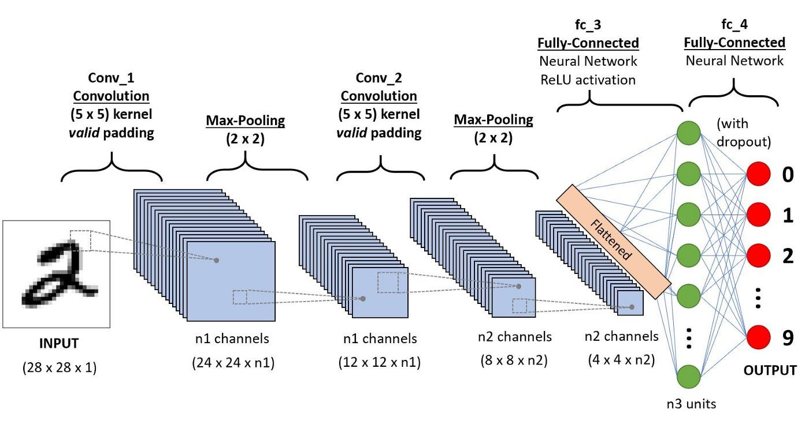

## 2.6 COMPUTER VISION & SPATIAL DATA (2D/3D)

**Quick links**
* [0. How to use this QRH](0%20-%20hot%20to%20use.md#13-decision-tree-vision-and-time-series-space--time)
* [2.5 Time Series](2.5%20-%20time%20series.md)
* [2.7 NLP](2.7%20-%20NLP.md)
* Sections: [2D-CNN Backbones](#261-2d-cnn-backbones-resnet-efficientnet), [YOLO](#262-yolo-family-you-only-look-once), [U-Net](#263-u-net), [Mask R-CNN](#264-mask-r-cnn), [ViT](#265-vision-transformers-vit)

### 2.6.1 2D-CNN BACKBONES (ResNet, EfficientNet)
**[SUPERVISED] [2D VISION] [CLASSIFICATION] [FEATURE EXTRACTION]**

**LEVEL 1: TRIAGE**
* **Input / Output:** Input: Image tensor `[Batch, Height, Width, Channels]`. Output: Class logits (Classification) or dense feature vector (Embeddings).
* **GO (Use when):** Image classification. Need to extract spatial visual features to feed other models (e.g. detection, captioning). Transfer Learning (use pre-trained weights on ImageNet).
* **NO-GO (Avoid when):** Purely sequential or tabular data. When you do not have resources to exploit Transfer Learning (training a ResNet from scratch on 1000 images is a failure).

**LEVEL 2: OPERATIONS**
* **Principles of operation:**
  * **Spatial Convolution:** NxN filters (usually 3x3) slide across the image extracting visual hierarchies (from edges and corners in early layers to complex concepts like “eyes” or “wheels” in deeper layers).
  * **ResNet (Residual Networks):** Introduces *Skip Connections* (adds the input of a block to its output) eliminating the Vanishing Gradient problem and enabling deep 100+ layer networks.
  * **EfficientNet:** Scales network width, depth, and resolution using a balanced mathematical formula, maximizing accuracy for the same FLOPs.

| PROS | CONS |
| :--- | :--- |
| Excellent Transfer Learning (massive availability of pre-trained weights). | Strong inductive bias: rigid to extreme spatial transformations if not present in training. |
| Highly optimized for inference on edge and mobile hardware (e.g. TFLite, TensorRT). | Loss of spatial information at very high resolution due to Pooling layers. |

**LEVEL 3: DEEP DIVE & TROUBLESHOOTING**
* **Key Hyperparameters:**
  * `learning_rate` and Schedule: Critical. Often requires Cosine Annealing or Warm-up.
  * `batch_size`: The larger it is, the more stable the gradients. Heavily limited by [GPU](0%20-%20hot%20to%20use.md#essential-acronym-glossary) [VRAM](0%20-%20hot%20to%20use.md#essential-acronym-glossary).
  * Layer Unfreeze: In Transfer Learning, only the last dense head is trained. If there is plenty of data, progressively unfreeze the higher convolutional blocks.
* **Typical Loss Function:** Categorical Cross-Entropy (Multi-class Classification), [BCE](0%20-%20hot%20to%20use.md#essential-acronym-glossary) (Multi-label).
* **Common Pitfalls & Quick Fixes:**
  * **Pitfall:** Strong Overfitting. 99% accuracy in training, 60% in validation.
    * *Quick Fix:* CNNs memorize images if the dataset is small. Apply heavy **Data Augmentation** (rotations, random crops, color jittering, MixUp, CutMix) to force the network to generalize.

---

### 2.6.2 YOLO FAMILY (You Only Look Once)
**[SUPERVISED] [2D VISION] [OBJECT DETECTION] [REAL-TIME]**

**LEVEL 1: TRIAGE**
* **Input / Output:** Input: Image. Output: Bounding Box coordinates `[x, y, w, h]`, Objectness Score, and class probability for each detected object.
* **GO (Use when):** Real-time tracking, video surveillance, robotics, automotive systems, high-framerate video analysis (>30 FPS).
* **NO-GO (Avoid when):** Perfect pixel-level boundaries are required (segmentation is needed). Microscopic heavily overlapping objects if aggressive anchor tuning is not done.

**LEVEL 2: OPERATIONS**
* **Principles of operation:**
  * **Single-Stage Detector:** Unlike older two-stage models, YOLO maps the entire image to an NxN grid and predicts boxes and classes simultaneously in a single forward pass.
  * **Objectness:** Predicts whether a box actually contains something relevant before classifying it.
  * Recent versions (YOLOv8, YOLOv10) are anchor-free, greatly simplifying the architecture and tuning.

| PROS | CONS |
| :--- | :--- |
| Unmatched speed in inference (pure Real-Time). | Traditionally less precise on very small objects than Two-Stage architectures. |
| Unified end-to-end architecture. | Requires specific and tedious dataset formatting (YOLO txt files). |

**LEVEL 3: DEEP DIVE & TROUBLESHOOTING**
* **Key Hyperparameters in Inference:**
  * `confidence_threshold` (e.g. 0.5): Discards bounding boxes the network is not confident about.
  * `iou_threshold` (for NMS - Non Maximum Suppression): Discards overlapping boxes pointing to the same object.
* **Typical Loss Function:** Weighted sum of Localization Loss (GIoU/CIoU for box coordinates) + Objectness Loss + Classification Loss.
* **Common Pitfalls & Quick Fixes:**
  * **Pitfall:** The model detects the same object three or four times, drawing overlapping boxes.
    * *Quick Fix:* The Non-Maximum Suppression (NMS) mechanism is too permissive. Lower the `iou_threshold` (e.g. from 0.6 to 0.4) to force the system to merge boxes colliding on the same target.

---

### 2.6.3 U-NET
**[SUPERVISED] [2D/3D VISION] [SEMANTIC SEGMENTATION]**

**LEVEL 1: TRIAGE**
* **Input / Output:** Input: Image HxW. Output: Tensor mask HxW where each pixel is assigned a class (e.g. Background=0, Tumor=1).
* **GO (Use when):** Medical imaging (radiographs, MRI), satellite analysis, industrial defectoscopy. Semantic segmentation where it is necessary to preserve both global context and local precision.
* **NO-GO (Avoid when):** You need to count or distinguish individual instances of the same class when they overlap (e.g. a pile of apples). U-Net sees “Apple,” not “Apple 1” and “Apple 2” (Instance Segmentation).

**LEVEL 2: OPERATIONS**
* **Principles of operation:**
  * **U-shaped Architecture (Encoder-Decoder):** The contracting path (Encoder) captures context by reducing spatial resolution. The expansive path (Decoder) restores the resolution to the original for localization.
  * **Skip Spatial Connections:** The real secret. It copies high-resolution feature maps from the Encoder and concatenates them to the Decoder, restoring the spatial details lost during pooling.

| PROS | CONS |
| :--- | :--- |
| Works surprisingly well even with very small datasets (a few hundred images). | RAM Intensive: skip connections force storing huge intermediate feature tensors in memory. |
| Pixel-level edge precision is extremely high due to the asymmetric design. | Slow in training if the high-resolution image is processed in full without patches. |

**LEVEL 3: DEEP DIVE & TROUBLESHOOTING**
* **Key Hyperparameters:**
  * Depth of the U (number of downsampling layers).
  * Upsampling method in the decoder: `Bilinear Interpolation` (fewer checkerboard artifacts, fewer parameters) vs `Transposed Convolution` (learnable, more powerful, prone to artifacts).
* **Typical Loss Function:** Dice Loss or Focal Loss (never use standard Cross Entropy in U-Net).
* **Common Pitfalls & Quick Fixes:**
  * **Pitfall:** Loss drops almost to zero immediately, but the network predicts a completely black mask (Background class).
    * *Quick Fix:* Severe Class Imbalance. The object of interest occupies only 2% of pixels, while background occupies 98%. If you optimize with standard accuracy using Cross Entropy, the network learns that predicting “Background” all the time gives 98% accuracy with zero effort. Replace the loss function with **Dice Loss** (evaluates the mathematical intersection of relevant pixels) or **Focal Loss** (penalizes easy-to-classify pixels).

---

### 2.6.4 MASK R-CNN
**[SUPERVISED] [2D VISION] [INSTANCE SEGMENTATION]**

**LEVEL 1: TRIAGE**
* **Input / Output:** Input: Image. Output: Bounding boxes + Classes + Binary mask specific to *each individual instance* detected.
* **GO (Use when):** Need to count overlapping objects of the same class while extracting precise contours (e.g. cars in a crowded parking lot, overlapping cells under a microscope).
* **NO-GO (Avoid when):** Edge devices with power limits, need for aggressive real-time, low [VRAM](0%20-%20hot%20to%20use.md#essential-acronym-glossary) availability.

**LEVEL 2: OPERATIONS**
* **Principles of operation:**
  * **Two-Stage Detector:**
    1. Stage 1 (RPN - Region Proposal Network): Scans the feature map suggesting areas where an object is “likely” to be present (ROI).
    2. Stage 2: From those regions, it extracts three outputs in parallel: Box, Class, and a pixel-level binary mask specific to that box via an FCN (Fully Convolutional) layer.
  * **RoIAlign:** Critical module that mathematically aligns extracted features without brutal rounding, preserving the exact spatial position of pixels.

| PROS | CONS |
| :--- | :--- |
| Excellent quality and boundary precision on individual instances. | Elephantine and computationally heavy architecture (slow). |
| Modular: can attach to different backbones (ResNet-50, ResNet-101). | Training pipeline and dataset formatting (e.g. COCO format) are very complex. |

**LEVEL 3: DEEP DIVE & TROUBLESHOOTING**
* **Common Pitfalls & Quick Fixes:**
  * **Pitfall:** Training or inference is unreasonably slow for the business task.
    * *Quick Fix:* Evaluate a strategic downscaling of the backbone (move from ResNet-101 to ResNet-50). If time is the real constraint, abandon the two-stage architecture and migrate to modern single-stage Instance Segmentation models (e.g. **YOLOv8-Seg** or **YOLACT**).

---

### 2.6.5 VISION TRANSFORMERS ([ViT](0%20-%20hot%20to%20use.md#essential-acronym-glossary))
**[SUPERVISED] [2D VISION] [CLASSIFICATION / SOTA BACKBONE](0%20-%20hot%20to%20use.md#essential-acronym-glossary)**

**LEVEL 1: TRIAGE**
* **Input / Output:** Input: Image. Output: Class predictions or massive embedding.
* **GO (Use when):** Availability of massive datasets (millions of images). Need to beat absolute state-of-the-art. Multimodal architectures aligning text and image embeddings (e.g. CLIP).
* **NO-GO (Avoid when):** Small or medium datasets. Limited compute resources (no [GPU](0%20-%20hot%20to%20use.md#essential-acronym-glossary) cluster).

**LEVEL 2: OPERATIONS**
* **Principles of operation:**
  * Completely abandons convolutions.
  * **Patching:** Cuts the image into grids (e.g. 16x16 pixel patches), flattens each patch into a vector (like “words” of a sentence).
  * **Self-Attention:** Patches pass through a classic Transformer Encoder (Multi-Head Attention). The network dynamically computes global spatial relations from the first layer (a patch in the upper-left correlates directly with one in the lower-right).

| PROS | CONS |
| :--- | :--- |
| Astronomically high performance ceiling: on huge scales it beats CNNs. | Extreme data hunger: without Inductive Bias, it needs unrealistic amounts of data to learn to see. |
| Captures the global context of the image from the first layer. | Computationally unsustainable on very high-resolution images (attention scales quadratically with patches). |

**LEVEL 3: DEEP DIVE & TROUBLESHOOTING**
* **Key Hyperparameters:**
  * `patch_size`: Critical. Small patches (14x14) capture fine details but explode the number of tokens (compute time O(N^2)). Large patches (32x32) are fast but lose resolution.
* **Common Pitfalls & Quick Fixes:**
  * **Pitfall:** A [ViT](0%20-%20hot%20to%20use.md#essential-acronym-glossary) trained from scratch on a custom small dataset performs embarrassingly, being beaten by a simple ResNet-18.
    * *Quick Fix:* ViTs do not have the innate geometric knowledge of CNNs (Inductive Bias — the idea that nearby pixels are correlated). If you have few data, **YOU MUST use pre-trained weights (Transfer Learning)** from massive datasets (ImageNet-21k, JFT-300M). Never train a [ViT](0%20-%20hot%20to%20use.md#essential-acronym-glossary) from scratch outside a Big Tech research hub.
