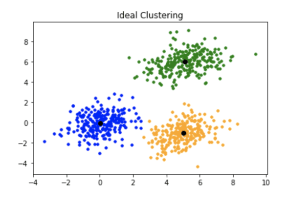
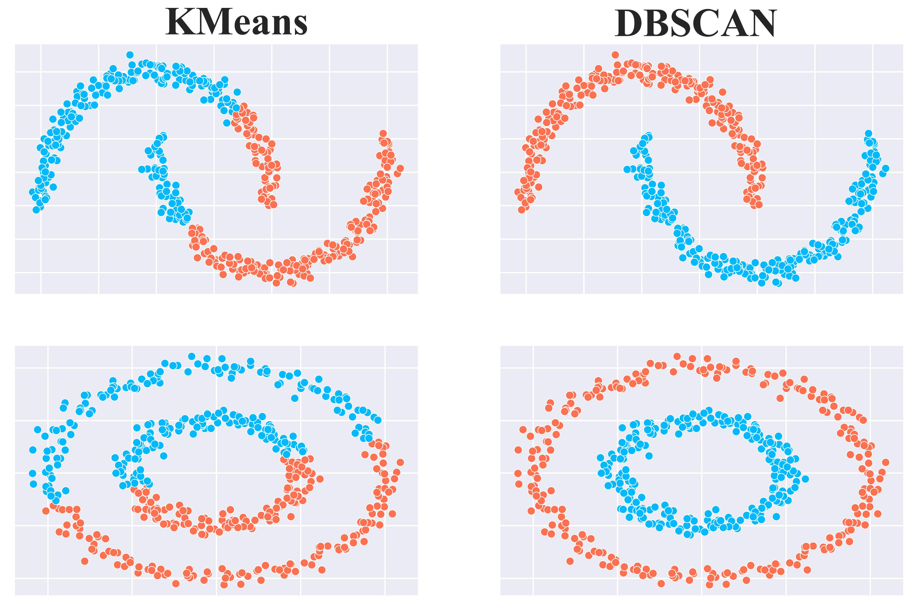
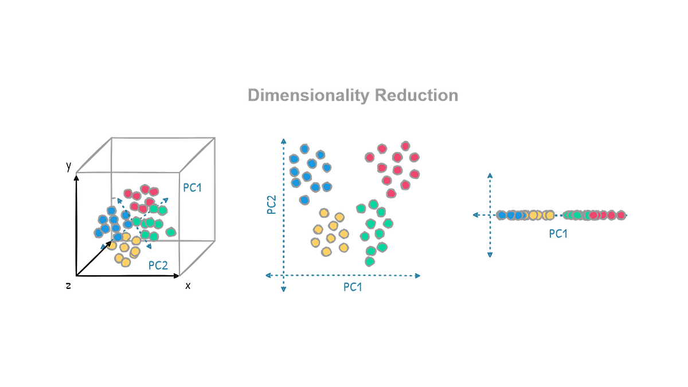
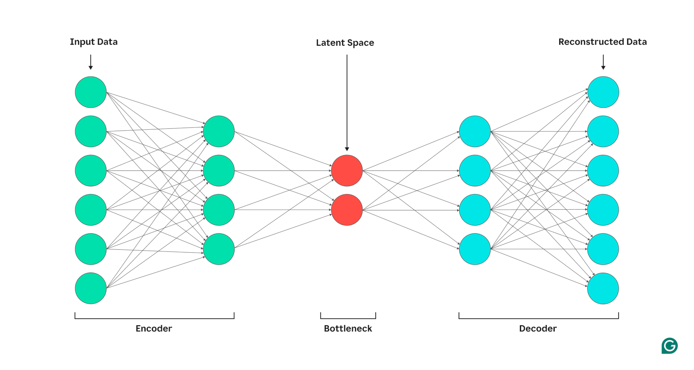

## 2.3 UNSUPERVISED & RAPPRESENTAZIONE

**Quick links**
* [0. Come usare questo QRH](0%20-%20hot%20to%20use.md#15-albero-decisionale-unsupervised-clustering--rappresentazione)
* [2.1 Baseline ML & Metodi Lineari](2.1%20-%20baseline_lineari.md)
* [2.2 Ensemble Methods](2.2%20-%20ensemble.md)
* [2.4 Deep Learning](2.4%20-%20deep%20learning.md)
* Sezioni: [Clustering: K-Means & DBSCAN](#231-clustering-k-means--dbscan), [Dimensionality Reduction](#232-dimensionality-reduction-pca-t-sne-umap), [Autoencoders](#233-autoencoders-standard--vae)

### 2.3.1 CLUSTERING: K-MEANS & DBSCAN
**[NON SUPERVISIONATO] [TABULARE / LATENTE] [CLUSTERING] [ANOMALY DETECTION]**

**LIVELLO 1: TRIAGE**
* **Input / Output:** Input: Vettori numerici rigorosamente normalizzati o **Spazi Latenti estratti da altri modelli**. Output: ID del cluster per ogni punto (e flag "outlier" per DBSCAN).
* **GO (Usare quando):** Segmentazione di dati tabulari. **Deep Clustering Pipeline:** applicati sull'output del bottleneck di un Autoencoder o di UMAP per raggruppare dati complessi (immagini, serie storiche).
* **NO-GO (Evitare quando):** Input diretti ad altissima dimensionalità (immagini raw, testo raw) senza preventiva riduzione (le distanze perdono senso matematico).

**LIVELLO 2: OPERATIONS**
* **Principi di funzionamento:**
  * **K-Means (Centroid-based):** Inizializza `K` centroidi, assegna ogni punto al centroide più vicino, ricalcola i centroidi come media dei punti, itera fino a convergenza (minimizzazione varianza intra-cluster).
  * **DBSCAN (Density-based):** Trova "core samples" ad alta densità e aggrega i punti vicini. I punti isolati in zone a bassa densità vengono etichettati come rumore/anomalie (-1).

| ALGORITMO | PRO | CONTRO |
| :--- | :--- | :--- |
| **K-Means** | Molto veloce, scala bene su grandi dataset. | Richiede di definire `K` a priori. Assume cluster sferici e di densità simile. Sensibile agli outlier. |
| **DBSCAN** | Non richiede di definire il numero di cluster. Trova cluster di forme arbitrarie. Isola le anomalie nativamente. | Flessibilità nulla se i cluster hanno densità molto diverse. Sensibile alla Maledizione della Dimensionalità. |

**LIVELLO 3: DEEP DIVE & TROUBLESHOOTING**
* **Iperparametri Chiave:**
  * **K-Means:** `n_clusters` (K). Per trovarlo: Metodo del Gomito (Elbow) sull'inerzia, o massimizzazione del Silhouette Score.
  * **DBSCAN:** `eps` (Raggio di ricerca locale), `min_samples` (Punti minimi per definire una zona densa).
* **Common Pitfalls & Quick Fixes:**
  * **Pitfall:** K-Means restituisce risultati completamente diversi a ogni run.
    * *Quick Fix:* L'inizializzazione casuale è caduta in minimi locali. Usa `init='k-means++'` (distanzia i centroidi iniziali).
  * **Pitfall:** DBSCAN aggrega tutto il dataset in un unico enorme cluster.
    * *Quick Fix:* L'iperparametro `eps` è troppo alto. Riduci `eps` o aumenta `min_samples`. Usa un *k-distance graph* per trovare l'`eps` ottimale (punto di massima curvatura).

---

### 2.3.2 DIMENSIONALITY REDUCTION: PCA, t-SNE, UMAP
**[NON SUPERVISIONATO] [TRASFORMAZIONE DATI] [VISUALIZZAZIONE]**

**LIVELLO 1: TRIAGE**
* **Input / Output:** Input: Matrice ad alta dimensionalità. Output: Matrice compressa a bassa dimensionalità (solitamente 2D/3D per visualizzazione o N-D per training a valle).
* **GO (Usare quando):** PCA: Rimozione della multicollinearità, riduzione del carico computazionale prima di altri modelli ML. t-SNE/UMAP: Esplorazione visiva 2D di dataset altamente complessi (es. embedding testuali o genomica).
* **NO-GO (Evitare quando):** t-SNE non va MAI usato per generare feature da dare in pasto a un modello predittivo (non preserva le distanze globali).

**LIVELLO 2: OPERATIONS**
* **Principi di funzionamento:**
  * **PCA (Lineare):** Proiezione ortogonale che cerca gli assi (Componenti Principali) in cui la varianza dei dati è massima.
  * **t-SNE (Non Lineare):** Converte le distanze in probabilità. Cerca di mantenere vicini nello spazio 2D i punti che erano vicini nello spazio originale. Ignora la struttura globale.
  * **UMAP (Non Lineare / Topologico):** Costruisce un grafo nello spazio originale e lo ottimizza nello spazio a bassa dimensione. È il successore di t-SNE.

| ALGORITMO | PRO | CONTRO |
| :--- | :--- | :--- |
| **PCA** | Veloce, deterministico, preserva struttura globale. Le componenti sono ortogonali. | Non cattura relazioni non lineari. Sensibile agli outlier. |
| **t-SNE** | Eccellente nel separare cluster visivamente. | Lento, stocastico (cambia a ogni run), distrugge le proporzioni di distanza globali. |
| **UMAP** | Più veloce di t-SNE, preserva meglio la topologia globale, può fare feature extraction utile per ML. | Richiede tuning meticoloso, la matematica sottostante è complessa (geometria differenziale). |

**LIVELLO 3: DEEP DIVE & TROUBLESHOOTING**
* **Iperparametri Chiave:**
  * **PCA:** `n_components` (Selezionare in base alla varianza spiegata cumulativa, es. 95%).
  * **t-SNE:** `perplexity` (Bilancia l'attenzione tra vicinato locale e globale, tipicamente tra 5 e 50).
  * **UMAP:** `n_neighbors` (Alto = focus su struttura globale; Basso = focus su dettagli locali), `min_dist` (Quanto i punti possono compattarsi).
* **Common Pitfalls & Quick Fixes:**
  * **Pitfall:** La prima componente della PCA domina con il 99% della varianza, ma i dati non hanno senso.
    * *Quick Fix:* Non hai scalato i dati. La PCA cerca la massima varianza assoluta: una feature misurata in "Milioni" schiaccerà una feature misurata in "Percentuali". `StandardScaler` obbligatorio.
  * **Pitfall:** I cluster generati da t-SNE sembrano tutti di dimensioni uguali e separati da distanze uguali.
    * *Quick Fix:* È un artefatto ottico di t-SNE: in questo algoritmo la dimensione del cluster e la distanza tra cluster diversi nello spazio 2D non hanno alcun significato metrico. Non trarre conclusioni analitiche, usa UMAP per preservare le distanze.

---

### 2.3.3 AUTOENCODERS (STANDARD & VAE)
**[NON SUPERVISIONATO] [DEEP LEARNING] [RAPPRESENTAZIONE] [ANOMALY DETECTION]**

**LIVELLO 1: TRIAGE**
* **Input / Output:** Input: Immagini, segnali temporali, o vettori densi. Output: 1. Ricostruzione dell'input. 2. **Vettore latente compresso (Bottleneck)**.
* **GO (Usare quando):** Denoising di immagini/segnali. Anomaly Detection (errore di ricostruzione alto su dati mai visti). **Feature Extraction (Deep Clustering):** usare il Bottleneck come input per modelli classici (K-Means/SVM) o per UMAP, permettendo al ML classico di digerire dati non strutturati.
* **NO-GO (Evitare quando):** Dataset tabulari semplici e piccoli (PCA è più rapida, interpretabile e meno prona all'overfitting).

**LIVELLO 2: OPERATIONS**
* **Principi di funzionamento:**
  * **Architettura a Clessidra:** Composto da un **Encoder** (riduce dimensionalità fino a un "Bottleneck" o Spazio Latente) e un **Decoder** (cerca di ricostruire l'input partendo solo dal Bottleneck).
  * **VAE (Variational Autoencoder):** Invece di mappare un input a un singolo punto latente, lo mappa a una distribuzione di probabilità (media e varianza). Forza lo spazio latente a essere continuo, permettendo di campionare nuovi punti inventati (Generazione).

| MODELLO | PRO | CONTRO |
| :--- | :--- | :--- |
| **Standard AE** | Ottimo per denoising e feature extraction deterministica. | Lo spazio latente è irregolare e "vuoto" in molti punti: non adatto per generare nuovi dati. |
| **VAE** | Spazio latente continuo e strutturato. Permette generazione, interpolazione tra immagini/dati e sampling. | Ricostruzioni spesso sfocate rispetto a GAN o Diffusion Models. Addestramento complesso. |

**LIVELLO 3: DEEP DIVE & TROUBLESHOOTING**
* **Iperparametri Chiave:**
  * Architettura Rete (Dimensione Bottleneck, numero di layer).
  * **VAE:** Peso della Divergenza KL (Beta). Bilancia la fedeltà di ricostruzione (Reconstruction Loss) con la regolarizzazione dello spazio latente.
* **Funzione di Loss Tipica:** MSE o BCE per la ricostruzione (Standard AE). MSE + Divergenza KL (VAE).
* **Common Pitfalls & Quick Fixes:**
  * **Pitfall (Standard AE):** L'Autoencoder ha loss pari a zero ma non impara features utili (restituisce l'input identico).
    * *Quick Fix:* Il bottleneck è troppo largo o la rete è troppo capace. L'AE sta funzionando come "Funzione Identità" (semplice copia-incolla). Riduci drasticamente i neuroni nel bottleneck o aggiungi rumore all'input (Denoising AE) per forzarlo a generalizzare.
  * **Pitfall (VAE):** "Posterior Collapse" o KL Vanishing. L'encoder ignora i dati in ingresso e predice sempre una gaussiana standard. Il decoder collassa generando sempre la stessa media.
    * *Quick Fix:* La loss KL sta dominando troppo presto nel training. Applica "KL Annealing": imposta il peso della loss KL a 0 all'inizio del training e alzalo linearmente verso 1 nel corso delle epoch, per permettere prima al decoder di imparare a ricostruire.