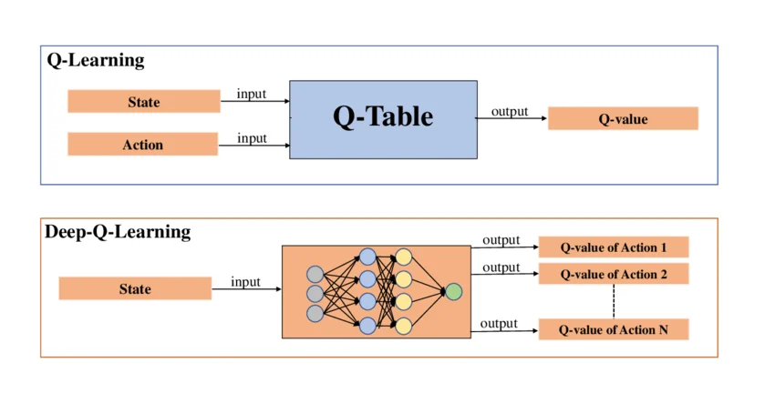

## 2.8 REINFORCEMENT LEARNING ([RL](0%20-%20hot%20to%20use.md#glossario-acronimi-essenziali))

**Quick links**
* [0. Come usare questo QRH](0%20-%20hot%20to%20use.md#1-decision-matrix)
* [2.7 NLP](2.7%20-%20NLP.md)
* [3. Troubleshooting](3%20-%20troubleshooting.md)
* Sezioni: [Q-Learning](#281-q-learning), [DQN](#282-dqn-deep-q-network), [PPO](#283-ppo-proximal-policy-optimization), [SAC](#284-sac-soft-actor-critic)

### 2.8.1 Q-LEARNING
**[RL TABULARE](0%20-%20hot%20to%20use.md#glossario-acronimi-essenziali) [OFF-POLICY] [VALUE-BASED] [AZIONI DISCRETE]**

**LIVELLO 1: TRIAGE**
* **Input / Output:** Input: Stato attuale. Output: Q-Value (utilità attesa) per ogni possibile azione in quello stato.
* **GO (Usare quando):** Ambienti completamente deterministici con spazi di stato e di azione molto piccoli e discreti (es. labirinti semplici, tic-tac-toe). Problemi modellabili come MDP (Markov Decision Process) finiti.
* **NO-GO (Evitare quando):** Lo spazio degli stati è continuo o immenso (es. coordinate spaziali millimetriche, pixel di uno schermo). La "Maledizione della Dimensionalità" esaurirebbe la RAM istantaneamente.

**LIVELLO 2: OPERATIONS**
* **Principi di funzionamento:**
  * **Q-Table:** Mantiene in memoria una matrice esatta [Stati x Azioni] che viene aggiornata costantemente.
  * **Equazione di Bellman:** Aggiorna il valore di una coppia stato-azione combinando la ricompensa immediata con il valore massimo atteso nello stato successivo (Temporal Difference, TD).
  * **Off-Policy:** L'algoritmo impara la policy ottimale ("cosa faresti al meglio delle tue possibilità") indipendentemente dalla policy di esplorazione in uso (che magari sta facendo mosse casuali).

| PRO | CONTRO |
| :--- | :--- |
| Garanzia matematica di convergenza alla policy ottimale (se ogni stato viene visitato infinite volte). | Inapplicabile nel mondo reale a causa dell'esplosione combinatoria degli stati. |
| Totalmente interpretabile: la Q-Table è direttamente ispezionabile. | Nessuna capacità di generalizzazione (due stati visivamente identici per un pixel sono celle di memoria separate). |

**LIVELLO 3: DEEP DIVE & TROUBLESHOOTING**
* **Iperparametri Chiave:**
  * `alpha` (Learning Rate): Quanto i nuovi calcoli sovrascrivono la memoria precedente.
  * `gamma` (Discount Factor): `0` = miopia estrema (valuta solo il reward immediato). `0.99` = visione a lungo termine (valuta l'intera catena di ricompense).
  * `epsilon` (Exploration Rate): Controlla la logica Epsilon-Greedy (probabilità di scegliere una mossa puramente casuale invece della migliore conosciuta per scoprire nuove strategie).
* **Funzione di Aggiornamento:** Temporal Difference (TD) Error.
* **Common Pitfalls & Quick Fixes:**
  * **Pitfall:** L'algoritmo gira all'infinito e la tabella non converge.
    * *Quick Fix:* Lo spazio di stato è troppo frammentato. Applica una discretizzazione (binning) severa (es. raggruppa le velocità continue in intervalli "bassa/media/alta") per ridurre le righe della Q-Table, oppure migra direttamente al DQN.

---

### 2.8.2 DQN (Deep Q-Network)
**[DEEP RL](0%20-%20hot%20to%20use.md#glossario-acronimi-essenziali) [OFF-POLICY] [VALUE-BASED] [AZIONI DISCRETE]**

**LIVELLO 1: TRIAGE**
* **Input / Output:** Input: Stato continuo e ad alta dimensionalità (es. tensore di pixel). Output: Q-Values per un set discreto di azioni (es. [Su, Giù, Salta, Spara]).
* **GO (Usare quando):** Videogiochi classici (Atari), controllo di logistica con input visivo. Spazi di stato enormi ma azioni rigorosamente discrete e limitate.
* **NO-GO (Evitare quando):** Spazi di azione continui (es. angolazione millimetrica del volante di un'auto, forza di torsione di un braccio robotico). DQN richiederebbe una discretizzazione brutale delle azioni, perdendo precisione.

**LIVELLO 2: OPERATIONS**
* **Principi di funzionamento:**
  * Sostituisce la Q-Table con una rete neurale (es. [CNN](0%20-%20hot%20to%20use.md#glossario-acronimi-essenziali) per i pixel) che mappa lo stato ai Q-Values.
  * **Experience Replay:** L'agente salva le transizioni passate `[Stato, Azione, Reward, Stato Successivo]` in un buffer (memoria). Durante il training, campiona mini-batch casuali dal buffer per spezzare la forte correlazione temporale dei dati sequenziali.
  * **Target Network:** Usa una rete clonata che si aggiorna molto lentamente per calcolare il target dell'Equazione di Bellman, stabilizzando l'addestramento (evita il problema del cane che insegue la propria coda).

| PRO | CONTRO |
| :--- | :--- |
| Gestisce input nativi complessi (immagini, array di sensori) grazie alle [CNN](0%20-%20hot%20to%20use.md#glossario-acronimi-essenziali)/[MLP](0%20-%20hot%20to%20use.md#glossario-acronimi-essenziali). | Soffre cronicamente di "Overestimation Bias" (tende a sovrastimare irrealisticamente i Q-Values). |
| Molto sample-efficient grazie al riutilizzo dei dati nel Replay Buffer. | Setting hardware ingombrante (richiede [GPU](0%20-%20hot%20to%20use.md#glossario-acronimi-essenziali) per il training della rete su dati bufferizzati). |

**LIVELLO 3: DEEP DIVE & TROUBLESHOOTING**
* **Iperparametri Chiave:**
  * `buffer_size`: Capacità dell'Experience Replay. Se troppo piccolo, il modello "dimentica" esperienze rare.
  * `target_update_frequency`: Ogni quanti step copiare i pesi dalla rete principale alla Target Network.
* **Funzione di Loss Tipica:** Huber Loss o [MSE](0%20-%20hot%20to%20use.md#glossario-acronimi-essenziali) applicata al TD Error.
* **Common Pitfalls & Quick Fixes:**
  * **Pitfall:** I Q-values esplodono verso infinito durante il training e la loss va in NaN.
    * *Quick Fix:* L'overestimation bias è fuori controllo. Passare obbligatoriamente all'architettura **Double DQN** (DDQN), che disaccoppia la selezione dell'azione dalla valutazione del suo valore, eliminando la sovrastima matematica cronica del Q-learning standard.

---

### 2.8.3 PPO (Proximal Policy Optimization)
**[DEEP RL](0%20-%20hot%20to%20use.md#glossario-acronimi-essenziali) [ON-POLICY] [ACTOR-CRITIC] [SOTA BASELINE](0%20-%20hot%20to%20use.md#glossario-acronimi-essenziali)**

**LIVELLO 1: TRIAGE**
* **Input / Output:** Input: Stato. Output: Probabilità di azioni (discreto) o Medie/Varianze (continuo) dall'Actor + Valore dello stato (Critic).
* **GO (Usare quando):** Baseline standard de facto dell'industria. Controllo robotico continuo, fine-tuning di [LLM](0%20-%20hot%20to%20use.md#glossario-acronimi-essenziali) (RLHF - Reinforcement Learning from Human Feedback), videogiochi complessi (es. Dota 2). Quando si vuole un algoritmo robusto che funzioni subito con pochi crash numerici.
* **NO-GO (Evitare quando):** Raccogliere campioni nell'ambiente costa troppo (es. robotica hardware reale fragile o simulazioni fisiche lentissime). PPO è incredibilmente affamato di dati freschi.

**LIVELLO 2: OPERATIONS**
* **Principi di funzionamento:**
  * **Actor-Critic:** Mantiene due reti. L'*Actor* decide cosa fare (la Policy). Il *Critic* giudica quanto è buono lo stato attuale (Value function) per aiutare l'Actor a correggersi.
  * **On-Policy:** L'algoritmo apprende SOLO dai dati raccolti dalla sua incarnazione attuale. Dopo ogni aggiornamento dei pesi, i dati vecchi vengono gettati via (niente Replay Buffer a lungo termine).
  * **Objective function clippata (Proximal):** Il nucleo di PPO. Impedisce matematicamente alla nuova Policy di allontanarsi troppo da quella vecchia (clipping ratio), garantendo aggiornamenti fluidi e prevenendo tracolli di prestazioni catastrofici in un singolo step.

| PRO | CONTRO |
| :--- | :--- |
| Estremamente stabile e quasi insensibile all'inizializzazione degli iperparametri. | Sample inefficiency drammatica (butta via i dati dopo averli usati). |
| Gestisce nativamente sia spazi continui che discreti. | Rischio di convergenza prematura in minimi locali se l'esplorazione non è forzata. |

**LIVELLO 3: DEEP DIVE & TROUBLESHOOTING**
* **Iperparametri Chiave:**
  * `clip_ratio` (Epsilon): Solitamente 0.2. Definisce la deviazione massima tollerata per update.
  * `entropy_coef`: Molto critico. Aggiunge un bonus alla Loss se la rete esplora azioni impreviste (combatte il collasso deterministico).
  * `gae_lambda` (Generalized Advantage Estimation): Regola il trade-off tra bias e varianza nel calcolo dei vantaggi delle azioni.
* **Funzione di Loss Tipica:** Somma della Policy Loss Clippata, Value Function Loss ([MSE](0%20-%20hot%20to%20use.md#glossario-acronimi-essenziali)), meno l'Entropia.
* **Common Pitfalls & Quick Fixes:**
  * **Pitfall:** L'agente impara una strategia sicura ma mediocre nei primi 10 minuti e poi smette completamente di esplorare (Loss piatta, Reward stagnante).
    * *Quick Fix:* L'Actor è diventato iper-sicuro troppo presto (probabilità dell'azione principale vicina al 100%). Aumenta l'`entropy_coef` (es. da 0.01 a 0.05) per forzare matematicamente il sistema a mantenere la curiosità viva.

---

### 2.8.4 SAC (Soft Actor-Critic)
**[DEEP RL](0%20-%20hot%20to%20use.md#glossario-acronimi-essenziali) [OFF-POLICY] [ACTOR-CRITIC] [MASSIMA ENTROPIA]**

**LIVELLO 1: TRIAGE**
* **Input / Output:** Input: Stato. Output: Azione in spazio continuo + Q-values.
* **GO (Usare quando):** Robotica (anche hardware reale), locomozione simulata complessa (Mujoco, PyBullet). L'ambiente richiede di ottimizzare ogni singola interazione risparmiando dati. Eccelle nei domini continui.
* **NO-GO (Evitare quando):** Spazi di azione strettamente discreti (es. videogiochi classici), sebbene esistano varianti SAC discrete, DQN o PPO sono solitamente setup più diretti per il dominio discreto.

**LIVELLO 2: OPERATIONS**
* **Principi di funzionamento:**
  * **Maximum Entropy [RL](0%20-%20hot%20to%20use.md#glossario-acronimi-essenziali):** Non ottimizza solo per massimizzare la ricompensa, ma massimizza esplicitamente la somma "Ricompensa + Entropia (Caos/Imprevedibilità)". Questo spinge l'agente a trovare molteplici strategie di successo valide, rendendolo robustissimo.
  * **Off-Policy con Actor-Critic:** Combina il meglio dei due mondi. Usa un Replay Buffer (come DQN) per essere estremamente sample-efficient, ma usa una struttura Actor-Critic (come PPO) per gestire azioni continue.
  * **Twin Critics:** Usa due reti Critico separate e prende sempre il valore minimo previsto tra le due per stroncare sul nascere l'Overestimation Bias cronico del dominio Q-learning.

| PRO | CONTRO |
| :--- | :--- |
| Sample efficiency eccezionale: perfetto se il simulatore o il robot sono lenti. | Richiede una marea di calcoli matematici sotto il cofano (usa 3 o 5 reti neurali contemporaneamente). |
| Trova policy altamente robuste che resistono a perturbazioni ambientali. | Sensibile alla scala delle ricompense (il trade-off ricompensa/entropia richiede bilanciamento). |

**LIVELLO 3: DEEP DIVE & TROUBLESHOOTING**
* **Iperparametri Chiave:**
  * `alpha` (Temperature): Regola l'importanza dell'entropia. Implementazioni moderne lo ottimizzano automaticamente come variabile appresa (Auto-Alpha).
  * `tau` (Polyak Averaging): Velocità di aggiornamento morbido (soft update) delle reti target (es. 0.005).
* **Common Pitfalls & Quick Fixes:**
  * **Pitfall:** Prestazioni instabili che degradano rapidamente. Il sistema fatica a bilanciare l'obiettivo con l'esplorazione.
    * *Quick Fix:* Il reward scaling è vitale in SAC. Poiché il sistema ottimizza `Reward + Alpha * Entropy`, se le tue ricompense ambientali vanno da 0 a 1.000.000 (e l'entropia è 1), l'entropia viene ignorata. Scala sempre i reward affinché abbiano magnitudo comparabile al termine di entropia, oppure assicurati che l'implementazione stia usando l'adattamento automatico di `alpha`.